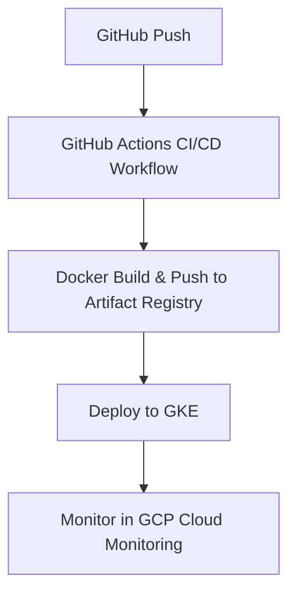

# GCP DevOps CI/CD Pipeline Project

This project demonstrates a **unique, production-style DevOps pipeline** entirely hosted on **Google Cloud Platform (GCP)**.  
It showcases **Infrastructure as Code (IaC)**, **containerization**, and **automated deployments** using GCP services.

The goal is to provide a **resume-worthy project** for showcasing DevOps skills to recruiters.

---

## 🚀 Project Overview

The pipeline performs the following:
1. **Infrastructure Provisioning**  
   - Terraform provisions a GCP Kubernetes Cluster (GKE), Cloud Storage, and IAM roles.
   
2. **Containerization**  
   - Application is built as a Docker image and pushed to **Google Artifact Registry**.

3. **Continuous Deployment**  
   - GitHub Actions deploys the latest application version to **GKE** after each push.

4. **Monitoring**  
   - GCP Cloud Monitoring and Logging are used to track performance and errors.

---

## 📂 Project Structure

```plaintext
.
├── terraform/
│   ├── gcp/
│   │   ├── main.tf          # Terraform configuration for GCP resources
│   │   ├── variables.tf     # Variables with placeholders
│   │   ├── outputs.tf       # Outputs after provisioning
│   │   └── provider.tf      # GCP provider configuration
├── app/
│   ├── Dockerfile           # Docker build instructions
│   ├── app.py               # Sample Python/Flask app
│   └── requirements.txt     # Python dependencies
├── .github/
│   └── workflows/
│       └── ci-cd.yml        # GitHub Actions CI/CD pipeline
└── README.md
```

---

## 🛠️ Technologies Used

- **Terraform** – Infrastructure as Code (IaC) for provisioning GCP resources.
- **Docker** – Containerization for consistent app deployment.
- **Google Kubernetes Engine (GKE)** – Orchestration of application containers.
- **Google Artifact Registry** – Private container image storage.
- **GitHub Actions** – Continuous Integration and Deployment pipeline.
- **GCP Cloud Monitoring** – Observability and performance tracking.

---

## 🔑 Setup Instructions

### 1️⃣ Clone this repository
```bash
git clone https://github.com/<your-username>/<repo-name>.git
cd <repo-name>
```

### 2️⃣ Configure GCP Authentication
- Create a GCP service account with:
  - Kubernetes Engine Admin
  - Artifact Registry Admin
  - Storage Admin
- Download the **JSON key file** and save it locally.

### 3️⃣ Update Terraform Variables
In `terraform/gcp/variables.tf`, replace placeholders:
```hcl
variable "project_id" {
  default = "<YOUR_PROJECT_ID>"
}

variable "credentials_file" {
  default = "<PATH_TO_YOUR_SERVICE_ACCOUNT_KEY.json>"
}
```

### 4️⃣ Provision Infrastructure
```bash
cd terraform/gcp
terraform init
terraform apply -auto-approve
```

### 5️⃣ Build & Push Docker Image
```bash
docker build -t <REGION>-docker.pkg.dev/<PROJECT_ID>/<REPO>/<IMAGE_NAME>:v1 .
docker push <REGION>-docker.pkg.dev/<PROJECT_ID>/<REPO>/<IMAGE_NAME>:v1
```

### 6️⃣ Deploy via GitHub Actions
- Add the following GitHub secrets:
  - `GCP_PROJECT_ID`
  - `GCP_SA_KEY` (base64 encoded service account key)
  - `GCP_REGION`
- Push changes to trigger the pipeline.

---

## 📊 Pipeline Workflow



---

## 🌟 Why This Project is Unique

Unlike typical beginner DevOps projects, this one:
- Uses **only GCP** for a real-world cloud-native workflow.
- Implements **Terraform** for reproducible environments.
- Integrates **GitHub Actions** for automated CI/CD.
- Showcases **monitoring and logging** for observability.

---

## 📌 GitHub Link for Resume
Once uploaded, add this to your CV:
```
https://github.com/<your-username>/<repo-name>
```

---

## 📄 License
This project is open-source under the MIT License.

